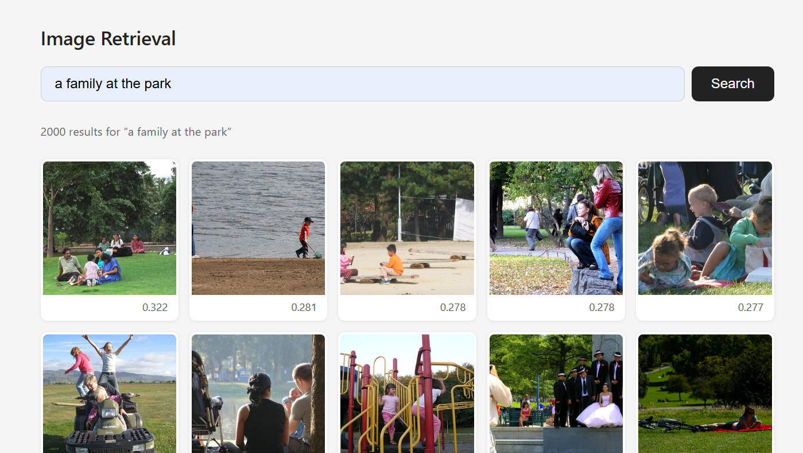
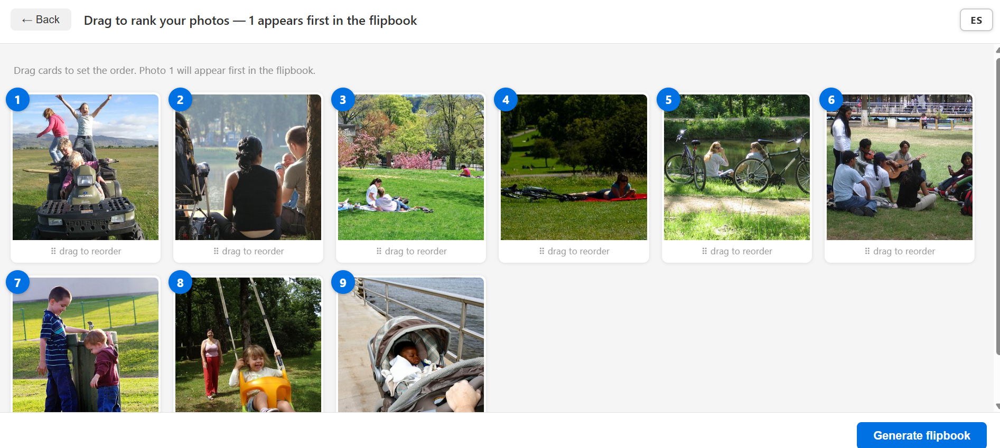
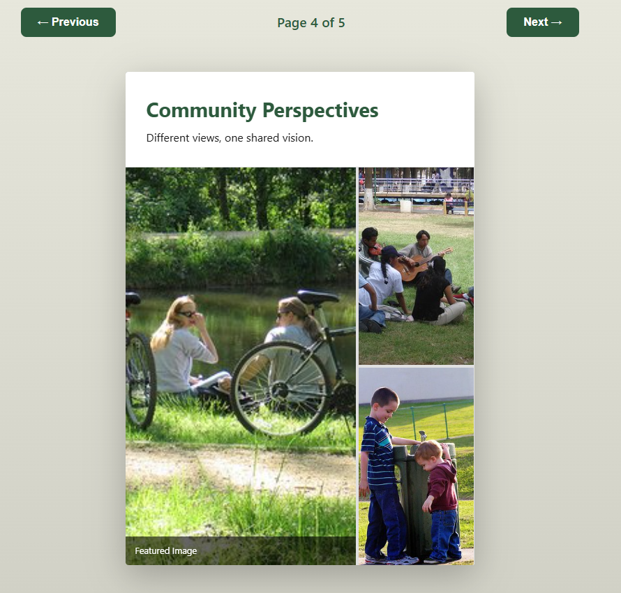

# Las Agencias

Participatory AI audit tool for evaluating vision-language models (CLIP) in real community contexts.
Participants use a semantic image retrieval interface to design a leaflet, selecting and ranking images returned by CLIP.
Their choices are compared against the FAIR fairness metric to test whether it predicts human behaviour.

---

## How it works

1. **Startup** — loads the image pool (curated images + FHIBE distractors), computes CLIP (ViT-B-16) embeddings, caches them to `data/<pool>.pt`.
   Subsequent runs load from cache instantly (invalidated if model or image count changes).

2. **Search** — participant types a prompt; the server encodes it with the CLIP text encoder, computes cosine similarity
   against all image embeddings, and returns the full ranked list (curated and distractors mixed).

3. **Select** — participant clicks up to 9 images. Selection time is tracked silently in the background.

4. **Order** — drag-to-rank the 9 selected images from most to least relevant, then submit.

5. **Flipbook** — selections are saved to SQLite (`data/rankings.db`) and the browser renders a 5-page animated flipbook.

---

## Image pool

The retrieval pool combines two sources:

| Source | Folder | `is_curated` | Role in FAIR |
|--------|--------|--------------|--------------|
| Curated images | `data/situated-usecase-image-pool-v01/images_v01/` | `1` | Utility signal G[i]; demographic counts update `D_r^i` |
| FHIBE distractors | `data/fhibe/` | `0` (implicit) | Occupy rank positions; never update `D_r^i` |

**160 curated images** are annotated in `data/situated-usecase-image-pool-v01/intervisions_annotations_v01.csv` and
converted to `data/annotations.json` by `scripts/prepare_annotations.py`.  
**FHIBE distractors** have no annotations — the FAIR calculator treats any image missing from `annotations.json` as a distractor automatically.

---

## Quick start

```bash
pip install -r requirements.txt

# Step 1 — generate annotations JSON from the curated image CSV (one-time)
python scripts/prepare_annotations.py

# Step 2 — pre-calculate FAIR metrics for all queries
python scripts/precalculate_metrics.py \
    --curated-folder  data/situated-usecase-image-pool-v01/images_v01 \
    --distractor-folder data/fhibe \
    --queries     data/queries.json \
    --annotations data/annotations.json \
    --output      data/metrics/query_metrics.json

# Step 3 — start the server
python server.py \
    --curated-folder  data/situated-usecase-image-pool-v01/images_v01 \
    --distractor-folder data/fhibe
```

Then open http://127.0.0.1:8080

> **Without FHIBE yet?** Omit `--distractor-folder` to run with curated images only. Add FHIBE later and re-run both steps 2 and 3.

---

## CLI options

### `server.py`

| Flag | Default | Description |
|------|---------|-------------|
| `--curated-folder` | — | Curated image folder (`is_curated=1`) |
| `--distractor-folder` | — | FHIBE distractor folder (`is_curated=0`); optional |
| `--max-curated` | `2000` | Max curated images to load |
| `--max-distractors` | `2000` | Max distractor images to load |
| `--folder` | — | Legacy: single-folder mode (all images treated equally) |
| `--hf-repo` | — | Legacy: HuggingFace dataset repo |
| `--model` | `ViT-B-16` | OpenCLIP model architecture |
| `--pretrained` | `openai` | Pretrained weights key |
| `--device` | `auto` | `cuda`, `cpu`, or `auto` |
| `--host` | `127.0.0.1` | Server host |
| `--port` | `8080` | Server port |

### Examples

```bash
# Standard run (curated + FHIBE distractors)
python server.py \
    --curated-folder  data/situated-usecase-image-pool-v01/images_v01 \
    --distractor-folder data/fhibe

# Limit FHIBE distractors to 500
python server.py \
    --curated-folder  data/situated-usecase-image-pool-v01/images_v01 \
    --distractor-folder data/fhibe \
    --max-distractors 500

# Curated images only (no FHIBE yet)
python server.py \
    --curated-folder data/situated-usecase-image-pool-v01/images_v01

# Expose on local network for participants on their own devices
python server.py \
    --curated-folder  data/situated-usecase-image-pool-v01/images_v01 \
    --distractor-folder data/fhibe \
    --host 0.0.0.0 --port 8080
```

---

## Participant flow

### Step 1 — Search and select
Write a prompt; CLIP retrieves and ranks matching images. Select up to 9.



### Step 2 — Order
Drag the selected images into your preferred order (1 = most relevant).



### Step 3 — Flipbook
A 5-page animated flipbook is generated with the images in the chosen order.



---

## Workshop guide

This section documents how to run Las Agencias as a data collection instrument across multiple communities.
The goal is to compare how different groups select and order AI-retrieved images, and to test whether
the FAIR metric predicts those community outcomes.

### Overview of the research workflow

```
Before workshops:
  1. Generate annotations JSON from the curated image CSV  ← scripts/prepare_annotations.py
  2. Download FHIBE distractors to data/fhibe/             ← see "Downloading FHIBE" below
  3. Fill in data/desired_distribution.json                ← target demographic proportions
  4. Pre-calculate FAIR metrics for all queries            ← scripts/precalculate_metrics.py

On the day (per community):
  5. Start recording in admin panel                        ← /admin
  6. Run sessions with participants
  7. Stop recording

After all workshops:
  8. Export raw data                                       ← /api/export_analysis
  9. Correlate metrics with outcomes                       ← metrics/analyze_outcomes.py
```

---

### Before the workshops

**1. Generate annotations.json**

The curated image annotations live in:

```
data/situated-usecase-image-pool-v01/intervisions_annotations_v01.csv
```

Columns: `image_path`, `term`, `perceived_gender` (0/1/2), `perceived_age` (text), `perceived_skin_tone` (1–6), `perceived_disability`.

Convert to the JSON format expected by the FAIR calculator:

```bash
python scripts/prepare_annotations.py
# Output: data/annotations.json  (160 entries, is_curated=1 for all)
```

The script maps gender values: `0 → "M.Male"`, `1 → "NB"`, `2 → "M.Female"`.  
FHIBE distractors do **not** need entries — any image absent from `annotations.json` is treated as a distractor automatically.

The resulting `annotations.json` looks like:

```json
{
  "data/situated-usecase-image-pool-v01/images_v01/task6_1778494475_20351cbc.jpg": {
    "is_curated": 1,
    "gender":     "M.Male",
    "age":        "Middle-aged (31-60)",
    "skin_tone":  6
  }
}
```

**`is_curated`** — `1` if the image is campaign-appropriate (curated), `0` if it is a distractor. This is the utility signal `G[i]` in the FAIR formula. Images missing this field are treated as distractors.

**Valid demographic values:**

| Axis | Valid values | Invalid (excluded from D_r^i) |
|------|--------------|--------------------|
| `gender` | `"M.Male"`, `"NB"`, `"M.Female"` | `"Cannot determine"` |
| `age` | `"Child (0-12)"`, `"Adolescent (13-17)"`, `"Young adult (18-30)"`, `"Middle-aged (31-60)"`, `"Older adult (60+)"` | `"Cannot determine"` |
| `skin_tone` | integers `1`–`6` (Fitzpatrick Scale) | `0`, `"?"`, or anything else |

Age is grouped into three categories for analysis:

| Raw value | Group |
|-----------|-------|
| Child / Adolescent / Young adult | `young` |
| Middle-aged | `middle` |
| Older adult | `older` |

Fitzpatrick Scale is grouped into three categories:

| FST | Group |
|-----|-------|
| 1–2 | `light` |
| 3–4 | `medium` |
| 5–6 | `dark` |

---

**2. Download FHIBE distractors**

FHIBE lives on the CVC server. Download it with rsync (resumable):

```bash
rsync -avz --progress \
  <username>@<cvc-hostname>:/data/datasets/FHIBE/fhibe.20250716.u.gT5_rFTA_downsampled_public/ \
  data/fhibe/
```

Or with scp:

```bash
scp -r \
  <username>@<cvc-hostname>:/data/datasets/FHIBE/fhibe.20250716.u.gT5_rFTA_downsampled_public/ \
  data/fhibe/
```

The expected local path is `data/fhibe/`. The `--max-distractors` flag (default `2000`) controls how many are loaded.
Start with 500–1000 distractors for a realistic pool without excessive memory use.

Embeddings for FHIBE are computed and cached automatically on first run; no manual step needed.

---

**3. Set the desired distribution**

Edit `data/desired_distribution.json` to reflect the target demographic proportions for your image pool.
Leave values as `null` to fall back to uniform distribution (⅓ per category). Fill in after annotation:

```json
{
  "gender":    {"M.Male": 0.40, "NB": 0.10, "M.Female": 0.50},
  "age":       {"young": 0.35, "middle": 0.45, "older": 0.20},
  "skin_tone": {"light": 0.30, "medium": 0.40, "dark": 0.30}
}
```

---

**4. Review your queries**

`data/queries.json` contains the exact prompts participants will use:

```json
[
  "A person pushing a person in a wheelchair",
  "A person taking care of a child in a park"
]
```

Use the same prompts across all workshops. Wording differences break the cross-community comparison.

---

**5. Pre-calculate FAIR metrics**

Run once before the first workshop, after completing steps 1–4:

```bash
python scripts/precalculate_metrics.py \
    --curated-folder  data/situated-usecase-image-pool-v01/images_v01 \
    --distractor-folder data/fhibe \
    --queries     data/queries.json \
    --annotations data/annotations.json \
    --output      data/metrics/query_metrics.json
```

Options:

| Flag | Default | Description |
|------|---------|-------------|
| `--curated-folder` | required* | Curated images folder |
| `--distractor-folder` | — | FHIBE distractor folder (optional) |
| `--queries` | required | Path to queries JSON |
| `--annotations` | required | Path to annotations JSON |
| `--output` | `data/metrics/query_metrics.json` | Where to write results |
| `--k` | `20` | Ranking depth to evaluate |
| `--model` | `ViT-B-16` | CLIP model (must match server) |
| `--max-curated` | `2000` | Max curated images |
| `--max-distractors` | `2000` | Max distractor images |

\* Use `--folder` or `--hf-repo` for legacy single-pool mode.

This saves one JSON entry per query:

```json
{
  "A person pushing a person in a wheelchair": {
    "model_ranking": ["data/situated.../task6_....jpg", "..."],
    "n_curated":  18,
    "n_total":    20,
    "FAIR_gender": 0.5876,
    "FAIR_age":    0.6679,
    "FAIR_skin_tone": 0.7805,
    "valid_annotations_gender": 18,
    "valid_annotations_age": 17,
    "valid_annotations_skin_tone": 18,
    "calculated_at": "2026-05-15T11:30:00+00:00"
  }
}
```

**Metric definition:**

`FAIR` (Fairness-Aware Information Retrieval) combines curation utility with demographic fairness:

```
FAIR = (1/M) · Σᵢ₌₁ᵏ [G[i] · (1/(KL(D_r^i‖D*) + 1)) / log₂(i+1)]
```

- `G[i]` = `is_curated[i]` = 1 if rank-i image is campaign-appropriate, 0 if a distractor
- `D_r^i` = demographic distribution over **curated images only** in the top-i prefix (distractors don't update demographic counts)
- `D*` = desired distribution from `data/desired_distribution.json`
- `KL(D_r^i‖D*)` = `Σ_c D_r^i[c] · log(D_r^i[c] / D*[c])` — divergence from observed to desired (Gao et al. 2022); absent categories contribute 0 naturally; KL = 0 when no curated images appear in prefix yet
- `1/log₂(i+1)` = position discount (earlier ranks count more)
- `M` = normalisation constant (sum of position discounts over all k positions)
- Higher = better retrieval of curated images with balanced demographics

---

### On the day: facilitator setup

The facilitator controls data collection through the **admin panel** at `/admin` — no terminal commands needed on the day.

**Step 1 — Open the admin panel**

Navigate to `http://localhost:8080/admin` (or your deployed URL + `/admin`).

**Step 2 — Start recording**

Fill in the workshop details and click **Start recording**:

- **Workshop name** — e.g. "LGBT+ Barcelona"
- **Community context** — e.g. "LGBTQ+", "Roma", "Migrants", "Youth"
- **Location** and **Date** — for your records
- **Facilitator** — your name

The banner turns green and shows a pulsing dot. All participant sessions from this point are linked to this workshop.

**Step 3 — Share the participant URL**

The admin panel shows the URL to share with the room. Participants open it on their own devices.

**Step 4 — Stop recording**

When the workshop is done, click **Stop recording**. All data is retained; no new sessions will be linked until the next workshop is started.

**Between workshops** — repeat steps 2–4 for each community. All data stays in the same database, separated by workshop ID.

---

### During the workshop: participant flow

1. **Enter a prompt** — the facilitator reads the prompt aloud; participants type it in exactly.
2. **Browse and select** — pick up to 9 images that best fit the prompt. (Selection time is recorded automatically.)
3. **Order them** — drag to rank from most to least relevant, then submit.

The flipbook is a receipt for the participant. The ranking and timing data is what matters for analysis.

**Facilitator notes:**
- Use identical prompts across all workshops.
- Participants should not see each other's screens while selecting.
- Each prompt is a separate session — participants submit and start fresh for the next prompt.
- There is no login — each submission is a new anonymous session linked to the active workshop.

---

### After all workshops: analysis

**Step 1 — Export the raw data (optional)**

```bash
curl http://localhost:8080/api/export_analysis -o rankings_export.csv
```

Columns: `session_id`, `workshop_id`, `workshop_name`, `community_context`, `prompt`, `selection_time_seconds`, `image_index`, `model_rank`, `user_rank`.

**Step 2 — Correlate FAIR/NDKL with community outcomes**

```bash
python metrics/analyze_outcomes.py
```

Or with explicit paths:

```bash
python metrics/analyze_outcomes.py \
    --metrics data/metrics/query_metrics.json \
    --db      data/rankings.db \
    --output  results/metric_alignment_analysis.csv \
    --plots   results/correlation_plots
```

This reads the pre-calculated metrics and the workshop database, then computes Spearman correlations between each FAIR metric (gender/age/skin tone) and mean selection time — both pooled across all communities and separately per community.

Output: `results/metric_alignment_analysis.csv` with columns `group`, `metric`, `outcome`, `r`, `p_value`, `n_queries`.

Scatter plots are written to `results/correlation_plots/` if `--plots` is given (requires matplotlib).

---

## Tests

```bash
pip install pytest
python -m pytest tests/test_fair_calculator.py -v
```

Tests cover KL divergence, demographic distribution extraction, FAIR score calculation, and all edge cases (empty lists, "Cannot determine", invalid skin tone values, annotation gaps). No CLIP model is required.

End-to-end smoke test (requires model and images):

```bash
python scripts/test_swap.py
```

---

## Project structure

```
leaflet_design/
├── server.py                        # FastAPI server + routes + SQLite schema
├── retrieval.py                     # CLIP embedding + retrieval engine (ViT-B-16)
├── requirements.txt
│
├── metrics/
│   ├── fair_calculator.py           # FAIR calculation (FAIRCalculator class)
│   └── analyze_outcomes.py          # Post-workshop: Spearman correlation analysis
│
├── scripts/
│   ├── prepare_annotations.py       # CSV → data/annotations.json (run once)
│   ├── precalculate_metrics.py      # CLI — run before workshops to calculate FAIR
│   └── test_swap.py                 # End-to-end smoke test
│
├── tests/
│   └── test_fair_calculator.py      # Unit tests (no CLIP required)
│
├── data/
│   ├── situated-usecase-image-pool-v01/
│   │   ├── images_v01/              # 160 curated images (is_curated=1)
│   │   └── intervisions_annotations_v01.csv  # Raw annotations from annotation tool
│   ├── fhibe/                       # FHIBE distractor images (is_curated=0, download separately)
│   ├── *.pt                         # Cached CLIP embeddings (auto-generated)
│   ├── rankings.db                  # SQLite: workshops, sessions, rankings
│   ├── annotations.json             # Generated by prepare_annotations.py
│   ├── queries.json                 # Workshop prompts (edit as needed)
│   ├── desired_distribution.json    # Target demographic proportions (fill in before workshops)
│   └── metrics/
│       └── query_metrics.json       # Pre-calculated FAIR (auto-generated by precalculate_metrics.py)
│
├── results/                         # Created by analyze_outcomes.py
│   ├── metric_alignment_analysis.csv
│   └── correlation_plots/
│
└── static/
    ├── index.html                   # Participant UI (search, select, order)
    ├── admin.html                   # Facilitator control panel (/admin)
    ├── flipbook.html                # Flipbook shell + per-session metrics panel
    ├── flipbook.js                  # Page-flip layout logic
    ├── flipbook.css                 # Styles + 3D animations
    ├── i18n.js                      # Localisation (EN / ES)
    └── locales/
        ├── en.json
        └── es.json
```

---

## API

| Method | Path | Description |
|--------|------|-------------|
| `GET` | `/` | Participant search UI |
| `GET` | `/flipbook?images=1,2,3&prompt=...` | Flipbook view |
| `GET` | `/admin` | Facilitator control panel |
| `GET` | `/api/search?query=...` | Returns all ranked `{indices, similarities}` |
| `GET` | `/api/image/{index}` | Returns image as JPEG (max 400×400) |
| `POST` | `/api/submit` | Saves session + selections + `selection_time_seconds`, computes FAIR/Spearman, links to active workshop |
| `GET` | `/api/session/{id}/metrics` | Returns pre-computed FAIR, NDKL, and Spearman metrics for a session |
| `POST` | `/api/workshop/create` | Creates a workshop record, returns `workshop_id` |
| `POST` | `/api/workshop/set_active?workshop_id=N` | Sets active workshop for new sessions |
| `POST` | `/api/workshop/deactivate` | Stops recording |
| `GET` | `/api/workshop/active` | Returns currently active workshop |
| `GET` | `/api/workshops` | Lists all workshops with session counts |
| `GET` | `/api/export_analysis` | Downloads full rankings CSV (includes `selection_time_seconds`) |

---

## Requirements

```bash
pip install -r requirements.txt
```

Core: `fastapi`, `uvicorn`, `open_clip_torch`, `torch`, `Pillow`, `datasets`, `numpy`, `pandas`

Analysis extras (not in requirements.txt — install separately if needed):
- `scipy` — exact p-values for Spearman correlations (numpy fallback included)
- `matplotlib` — scatter plots
- `pytest` — running the test suite

---

## Cloud deployment (systemd)

A `leaflet.service` file is included for running the app as a persistent background service on a Linux server.

**1. Edit the service file**

```bash
vi leaflet.service
```

Update at minimum:
- `User` / `Group` — your deploy user (default: `ubuntu`)
- `WorkingDirectory` — absolute project path (e.g. `/opt/leaflet_design`)
- `ExecStart` — update to use `--curated-folder` and `--distractor-folder`:

```ini
ExecStart=/opt/leaflet_design/.venv/bin/python server.py \
    --curated-folder  data/situated-usecase-image-pool-v01/images_v01 \
    --distractor-folder data/fhibe \
    --host 0.0.0.0 --port 8080
```

If your dataset requires a HuggingFace token, uncomment the `HF_TOKEN` line.

**2. Install and start**

```bash
sudo cp leaflet.service /etc/systemd/system/
sudo systemctl daemon-reload
sudo systemctl enable leaflet
sudo systemctl start leaflet
```

**3. Check status and logs**

```bash
sudo systemctl status leaflet
sudo journalctl -u leaflet -f
```

The service binds to `0.0.0.0:8080` by default — suitable behind a firewall or nginx reverse proxy.

---

## Funding Acknowledgement


Funded by the European Union. Views and opinions expressed are however those of the author(s) only and do not necessarily reflect those of the European Union or the European Education and Culture Executive Agency (EACEA). Neither the European Union nor EACEA can be held responsible for them.
